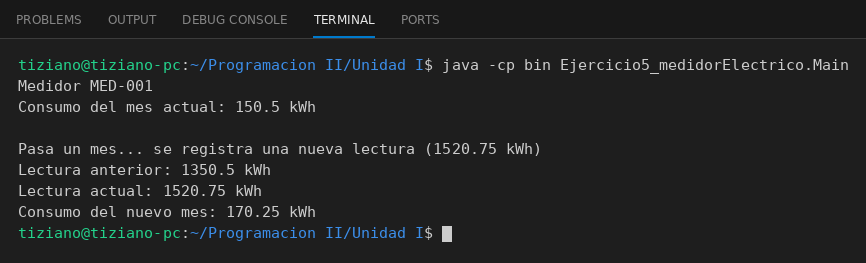

# MedidorElectrico

Programación II - Unidad 1 - Ejercicio 5

## Consigna
Modelar un medidor eléctrico de una cooperativa que registra lecturas en kWh para calcular el consumo neto del mes. En el `main` se instancia el medidor, se simula el paso de un mes registrando una nueva lectura y se muestra el consumo por consola.

## Lógica
- **Atributos (privados):** `numeroMedidor` (String), `lecturaAnterior` (double) y `lecturaActual` (double). Se accede a ellos con getters (encapsulamiento).
- **Constructor:** recibe los tres valores y valida que `lecturaActual >= lecturaAnterior`; si no, lanza `IllegalArgumentException`, así nunca existe un medidor en estado inválido.
- **`calcularConsumo()`:** retorna `lecturaActual - lecturaAnterior`, es decir, los kWh consumidos en el período.
- **`registrarNuevaLectura(double nuevaLectura)`:** valida que la nueva lectura no sea menor a la actual (un medidor no retrocede). Luego la lectura actual pasa a ser la anterior y la nueva pasa a ser la actual, dejando el medidor listo para calcular el consumo del mes siguiente.
- **`Main`:** crea el medidor con lecturas 1200.0 y 1350.5 (consumo 150.5 kWh), registra 1520.75 y muestra el nuevo consumo (170.25 kWh).

## Ejecución

